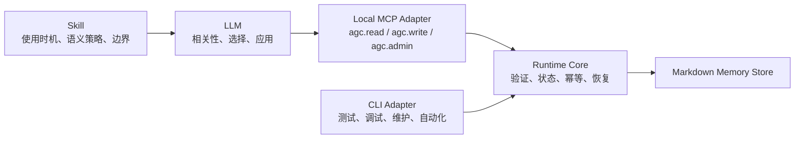

# Skill–MCP–Runtime 架构模式复盘

- 日期：2026-07-30
- 状态：已验证
- 来源：Agent Global Context v2 本地升级
- 主题：何时将 `Skill + CLI` 演化为 `Skill + MCP + Runtime`

## 摘要

Agent Global Context v2 最有价值的变化，不是简单地“把 CLI 包装成
MCP”，而是将一个原本容易混合提示词、命令执行和数据读写的 Skill，拆成
四个职责清晰的层次：

1. **Skill**：告诉 LLM 何时使用能力、如何判断相关性以及哪些边界不能越过。
2. **MCP Adapter**：把能力注册到 Agent 的原生工具空间，提供结构化调用协议。
3. **Runtime Core**：负责确定性的验证、存储、生命周期、备份、恢复和错误结果。
4. **CLI Adapter**：保留给测试、调试、人工维护和非 Agent 自动化。

因此，CLI 并没有被 MCP 替代。CLI 与 MCP 是同一个 Runtime Core 的两种
适配器。

这一模式最适合同时具有以下特征的能力：

- LLM 需要自主判断调用时机；
- 需要访问外部数据或持久化状态；
- 执行结果必须确定、可验证和可审计；
- 不希望把全部数据预先注入 Prompt；
- 能力可能被多个 Agent 或 Host 复用。

它不应该成为所有 Skill 的默认架构。纯方法论使用 Skill 即可；主要由人或
CI 调用的确定性脚本通常保留 CLI 更简单；高吞吐后台处理应由独立服务完成，
MCP 只作为控制或查询适配层。

## 1. 本次升级解决了什么问题

### 1.1 旧模式的隐含耦合

典型的 `Skill + CLI` 容易让 LLM 同时承担以下责任：

- 判断当前任务是否需要这项能力；
- 记住 CLI 命令、参数、安装路径和平台差异；
- 拼装命令行并处理转义；
- 解析 stdout、stderr 和 exit code；
- 判断执行结果是否真的成功；
- 直接参与状态写入和生命周期变更。

这会把语义判断、协议适配和确定性执行混在一起。Skill 文档越长，LLM 需要
记住的机械细节越多；CLI 输出越自由，调用结果越难稳定解释。

### 1.2 v2 的职责拆分



| 层次 | 主要问题 | 不负责什么 |
| --- | --- | --- |
| Skill | 什么时候用、为什么用、如何应用 | 不直接保证持久化正确性 |
| LLM | 语义相关性、匹配、取舍、表达 | 不决定文件路径和事务细节 |
| MCP Adapter | 工具发现、Schema、协议调用 | 不复制业务规则 |
| Runtime Core | 验证、存储、生命周期、幂等、备份和恢复 | 不判断自然语言语义相似度 |
| CLI Adapter | 人工、测试和非 Agent 调用 | 不是 Agent 的主要交互方式 |
| Markdown Store | 可读、可审计、可迁移的数据 | 不主动决定何时进入上下文 |

这里最重要的边界是：

> LLM 决定什么有意义，Runtime 保证执行结果是真的。

## 2. 为什么 MCP 是关键连接层

MCP 采用 Host–Client–Server 架构。Host 可以连接本地 stdio Server 或远程
Streamable HTTP Server，并在初始化时发现 Server 暴露的能力。

参考：

- [MCP Architecture Overview](https://modelcontextprotocol.io/docs/learn/architecture)
- [MCP Server Concepts](https://modelcontextprotocol.io/docs/learn/server-concepts)

对于 AGC，本地 MCP 带来了三个变化：

### 2.1 能力进入 Agent 的原生工具空间

只有 CLI 时，LLM 需要生成一段 shell 命令。注册 MCP 后，Host 可以发现工具
名称、描述和输入结构，LLM 直接执行工具调用。

这不是语法优化，而是控制方式改变：

```text
自然语言 → 生成命令行 → 解析进程输出
```

变成：

```text
自然语言 → 选择工具 → 结构化请求 → 结构化结果
```

### 2.2 数据不必提前进入 Prompt

AGC 的 Recall 使用渐进读取：

```text
overview → search → get → history/evidence
```

工具存在不代表记忆已经进入上下文。LLM 先判断是否值得 Recall，再从目录和
元数据逐步读取，获取足够信息后停止。

这使“能力可用”与“上下文已注入”分离，是控制 Prompt 噪声和 Token 成本的
关键。

### 2.3 Runtime 可以独立演进

Skill、MCP、CLI 都不再包含完整业务实现。Runtime Core 可以：

- 独立运行测试；
- 独立升级和回滚；
- 被 CLI 与 MCP 复用；
- 在不改变 Skill 决策规则的情况下修复执行问题；
- 在不改变持久化实现的情况下调整 Skill 的应用策略。

## 3. 为什么 AGC 只暴露三个工具

AGC v2 对外只暴露：

```text
agc.read
agc.write
agc.admin
```

### `agc.read`

负责渐进式 Recall：

- `overview`
- `search`
- `get`
- `history`
- `evidence`

### `agc.write`

负责记忆生命周期：

- 观察与候选；
- 确认与更新；
- 强化与冲突；
- 替代与归档；
- 明确授权的遗忘。

### `agc.admin`

负责系统维护：

- 初始化；
- 校验；
- 重建目录；
- 备份与恢复；
- 受控迁移。

### 三工具设计的收益

- 工具列表稳定；
- LLM 顶层选择更简单；
- 避免十几个细粒度工具造成选择噪声；
- 新增内部 action 时不一定需要改变公开工具集合；
- Read、Write、Admin 的风险边界清晰。

### 三工具设计的代价

- 顶层 MCP Schema 比“每个 action 一个工具”更通用；
- LLM 需要从 Skill 理解内部 action 契约；
- Runtime 必须进行更严格的二次验证；
- 单个工具描述无法完整表达所有细分动作。

因此，三个工具不是普遍最优数量，而是 AGC 在“工具选择噪声”和“Schema
精度”之间的选择。

## 4. 为什么使用 Tools，而不是自动加载 Resources

MCP Server 可以暴露三类核心能力：

| MCP Primitive | 主要控制者 | 适用场景 |
| --- | --- | --- |
| Tools | Model | 查询、计算、写入和外部操作 |
| Resources | Application | 被动、只读的上下文数据 |
| Prompts | User | 用户主动选择的流程模板 |

AGC 当前选择 Tools，是因为：

- Recall 本身需要查询、过滤和渐进决策；
- 不希望 Host 自动把完整记忆作为 Resource 注入；
- Read 和 Write 需要统一的结果 Envelope；
- 当前 North Star 强调“无关时保持安静”。

未来可以考虑把不含个人正文的 Catalog 元数据暴露成 Resource，但前提是 Host
不会因此默认注入更多上下文。否则 Resources 可能破坏低噪声目标。

## 5. 什么时候适合采用这种模式

### 强适配条件

一个能力满足下面多数条件时，适合使用 `Skill + MCP + Runtime`：

| 条件 | MCP 带来的价值 |
| --- | --- |
| LLM 需要自主判断是否调用 | 工具可由模型根据任务上下文选择 |
| 需要访问外部或持久化状态 | 状态不必复制到 Prompt |
| 操作必须确定、可验证 | Runtime 可以验证并返回稳定错误码 |
| 输入输出适合结构化表达 | 避免命令行和自由文本解析 |
| 需要渐进读取 | 降低上下文和 Token 成本 |
| 会被不同 Agent 或 Host 使用 | 使用统一协议接入 |
| 需要权限、备份、审计或回滚 | 可集中在 Runtime 和 Host 边界处理 |
| 能力需要独立测试和版本升级 | Runtime 不依赖当前 LLM 会话 |

### 典型场景

- 个人长期记忆；
- 项目知识库、代码图谱和 Wiki Runtime；
- 本地文档与制品管理；
- Trace、Eval 和运行记录查询；
- 数据库、日志和监控诊断；
- Git、CI、发布和 DevOps 控制；
- 日历、邮件和任务系统；
- 需要本地隐私边界的个人 Agent 能力。

## 6. 什么时候不应该使用 MCP

### 6.1 只有方法和规则

如果能力只是告诉 LLM 如何思考、写作、Review 或排查问题，没有状态和外部
执行，使用 Skill 即可。

### 6.2 固定的自动化流水线

如果流程始终是：

```text
输入文件 → 执行脚本 → 生成结果
```

且主要由人、CI 或定时任务触发，CLI 通常更简单。只有当 LLM 需要自主选择
调用时机、参数或工具组合时，MCP 才明显增值。

### 6.3 高频、低延迟的数据处理

MCP 是结构化工具协议，不是高吞吐数据管道。ETL、实时消息、批量计算和大规模
流式处理应由专门服务承担，MCP 只作为查询或控制接口。

### 6.4 无法接受模型自主调用的高风险操作

涉及生产删除、转账、权限变更和不可逆发布时，不能仅依赖工具描述。需要：

- Host 权限控制；
- 人类确认；
- 幂等键；
- 审计记录；
- 可验证的回滚边界。

MCP 官方规范也建议工具调用保持清晰的人类可见性和拒绝能力：

- [MCP Tools Specification](https://modelcontextprotocol.io/specification/2025-06-18/server/tools)

### 6.5 只有一个程序内部使用的小函数

如果能力不需要被 Agent 发现，也不会跨 Host 复用，直接函数调用比 MCP
更简单、更快。

## 7. 本地 MCP 与远程 MCP 的选择

| 维度 | 本地 stdio MCP | 远程 Streamable HTTP MCP |
| --- | --- | --- |
| 典型用户 | 单机、个人 Agent | 团队、多用户、多客户端 |
| 数据位置 | 本地文件和本地进程 | 中央服务或云端数据 |
| 网络依赖 | 运行时不需要远程调用链路 | 需要网络、认证和服务可用性 |
| 权限边界 | 操作系统用户和 Host 配置 | OAuth、租户、服务端授权 |
| 部署成本 | 本地依赖和版本管理 | 服务部署、运维和扩容 |
| 状态共享 | 默认单机 | 适合集中共享 |

AGC 当前选择本地 stdio MCP，是因为个人记忆优先考虑本地控制、隐私和单用户
使用，不需要引入一个持续运行的远程记忆服务。

## 8. 优点

### 架构收益

- Skill 与执行逻辑解耦；
- MCP 与 CLI 复用同一个 Runtime；
- 语义判断与确定性执行分离；
- 能力可以被不同 Agent 和 Host 发现；
- Runtime 可以独立测试、升级和回滚。

### 上下文收益

- 不必提前把所有数据放入 Prompt；
- 支持渐进式读取；
- 工具调用失败时可以降级继续主任务；
- 工具结果具有稳定状态和错误结构。

### 运维和安全收益

- 数据根目录由 Host 固定；
- LLM 不需要携带任意文件系统路径；
- 写入、备份、恢复和遗忘可以集中验证；
- 调用更容易记录、测试和审计。

## 9. 缺点

### 实现复杂度

- 需要处理安装、注册、依赖和版本兼容；
- 调试链路变成 Host → Client → Server → Runtime → Storage；
- 本地 stdio 会遇到路径、编码、进程和跨平台差异；
- Host 通常需要重启才能发现新增或更新的工具。

### LLM 不确定性

- 工具可用不代表模型一定会正确调用；
- Tool Schema 本身也消耗 Token；
- 工具过多会增加选择噪声；
- 通用工具加 action 会降低顶层 Schema 精度；
- 仍需要 Skill 告诉 LLM 何时调用和如何解释结果。

### 安全风险

- Model-controlled Tool 可能发生误调用；
- 写操作需要策略、权限和确认；
- 远程 MCP 还需要认证、授权、租户隔离和网络安全；
- MCP 解决连接协议，不自动解决业务数据质量。

## 10. 本次 AGC 升级中验证出的工程问题

这次升级说明，本地 MCP 并不是“写一个 Server 就结束”。实际需要解决：

- Skill 与工具契约是否一致；
- CLI 与 MCP 是否复用同一业务实现；
- MCP 工具数量是否制造选择噪声；
- 本地配置能否安全、幂等更新；
- Runtime 升级失败时旧版本是否仍可使用；
- Windows venv 和 console launcher 是否在最终路径有效；
- 记忆迁移是否可验证和回滚；
- 仓库验证材料是否泄露个人记忆语义；
- Runtime 失败时是否释放主任务而不是阻塞工作。

最终采用内容寻址 Runtime：

```text
<InstallRoot>/venvs/<runtime-content-sha256>/
```

新 Runtime 在最终路径安装并验证，只有验证通过后才切换 Host 配置；旧 venv
不会被原地修改。这一设计来自真实 Windows 入口路径问题，而不是理论上的
架构偏好。

## 11. 本次复盘中的范围控制教训

技术结果是正确的，但“本地升级”在执行中扩大成了“发布级产品完善”。其中
一些工作——例如极端 TOML 解析、完整迁移事务、内容寻址 Runtime 和多轮独立
审查——对长期可靠性有价值，却不都属于最小本地升级。

以后采用这一模式时，应把交付拆成两个层次：

### 最小可用接入

- Skill 能正确触发；
- MCP 能注册和调用；
- Runtime 能读写和校验；
- 数据有备份；
- Host 可以恢复旧配置。

### 发布级加固

- 敌对路径和配置输入；
- 多平台兼容；
- 崩溃恢复；
- 内容寻址部署；
- 完整迁移事务；
- 独立审查和发布构建。

在进入第二层之前，应明确确认成本和交付目标。做难而正确的事情，不等于把
所有困难一次做完，而是优先解决对当前目标最重要的困难。

## 12. 通用选择框架

```text
只有方法和规则
  → Skill

确定性脚本，主要由人、CI 或定时任务调用
  → CLI

LLM 需要自主发现并调用外部能力
  → MCP Adapter

能力包含状态、安全和复杂业务规则
  → Skill + MCP + Runtime

需要人工、测试或非 Agent 自动化入口
  → 在同一 Runtime 上保留 CLI Adapter

需要高吞吐、后台运行或多用户共享
  → 独立服务 + MCP Adapter
```

也可以使用下面的简化公式：

```text
MCP 价值
= 工具发现 + 结构化调用 + Host 集成 + 多 Agent 复用 + 渐进上下文
- 部署成本 - 生命周期复杂度 - 安全成本 - Tool Schema 噪声
```

只有当左侧收益长期大于右侧成本时，才值得引入 MCP。

## 13. AGC 的下一阶段

Skill–MCP–Runtime 模式已经解决了：

- 如何安全访问记忆；
- 如何渐进读取；
- 如何结构化写入；
- 如何验证、备份和恢复；
- 如何避免自动 Prompt 注入。

但它没有自动解决记忆采集率。下一阶段的核心问题是：

> 如何让 Codex 在不影响主任务、不显著增加 Token 的前提下，稳定产生高质量
> 候选记忆。

这应作为独立设计处理，不能因为已经有 MCP，就把所有对话自动写入记忆。
采集机制仍需要预算、失败开放、去重、候选生命周期和质量评估。

## 结论

Skill–MCP–Runtime 是一种有明确适用边界的 Agent 能力架构：

> Skill 负责认知策略，MCP 负责能力发现与调用，Runtime 负责确定性执行，
> CLI 负责人工与自动化入口。

它特别适合长期状态、个人数据、知识系统和需要可靠写操作的 Agent 能力；
但对于纯规则、小脚本和固定流水线，Skill 或 CLI 往往更简单。

AGC 是这一模式的强适配场景，因为它同时需要语义判断、持久化状态、渐进
读取、隐私边界、生命周期和失败恢复。真正值得复用的不是三个工具的具体
名字，而是这套职责分离方式。
