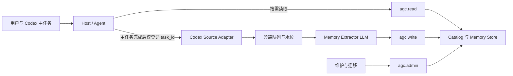

# Agent Global Context v2：个人成长型长期记忆系统设计

> 状态：设计定稿 v1.1（已通过规格自审与用户整体确认，待实施）  
> 日期：2026-07-28  
> 设计对象：`agent-global-context`  
> 文档目的：定义面向个人工作、学习、研究与成长的长期记忆层，以及低干扰、低人工参与的采集、演进和召回机制  
> 当前阶段：需求与设计；不包含实施计划

## North Star

> **让 Agent 记住一个真实且持续变化的人，理解其正在成为谁；在工作、生活、学习和研究中，于恰当时机使用最少必要的记忆，提供连续且促进成长的支持——关键时刻理解你，平常时候不打扰你。**

这条 North Star 高于具体的存储结构、分类、召回算法和采集指标。它包含四层含义：

1. **记住人**：不是保存聊天，而是理解背景、原则、偏好、目标、能力和变化轨迹。
2. **帮助成长**：记忆不能把用户冻结在过去，也不能只迎合旧习惯；它应结合用户明确的目标，帮助发现进步、能力缺口和长期模式。
3. **多维支持**：工作、生活、学习和研究共享同一个持续变化的人，但必须按场景、边界和敏感度召回。
4. **保持安静**：不相关就不召回，不为了展示“记得很多”而增加 Prompt、打断或心理负担。

所有 AGC 设计和记忆决策都应通过四个问题：

- 它是否让 Agent 更准确地理解这个人？
- 它是否可能改善未来的支持或成长？
- 它是否与当前场景真正相关？
- 它产生的价值是否大于噪声、隐私和 Token 成本？

任何一项明显不成立，就不应该采集或召回。

记忆条数、Capture 次数和 Recall 率都不是 North Star 指标。真正的成功是：

> 在需要用户背景的关键时刻，用到了正确的记忆；在不需要时，几乎感受不到记忆系统的存在。

## 1. 核心结论

`agent-global-context` 的定位不是项目知识库，也不是聊天归档，而是一个跨任务、跨项目、会随时间变化的个人长期记忆层。

它需要长期帮助 Agent 理解：

- 用户是谁，以及哪些背景会影响协作。
- 用户怎样工作、学习、研究和做决策。
- 用户当前关注什么，兴趣和目标如何变化。
- 用户已经形成哪些能力，哪些方面仍在成长。
- 哪些原则、偏好和行为模式应该影响后续任务。
- 哪些项目与经历只是当前阶段上下文，哪些已经成为个人长期轨迹的一部分。

本设计采用以下总体方案：

1. 以 Markdown 作为 normal 和 personal 正式记忆的事实来源。
2. 使用一个小型本地 AGC Runtime 处理确定性操作。
3. 使用一个薄 `agent-global-context` Skill 负责触发与路由。
4. 由 LLM 判断记忆是否与当前任务相关，以及新信息应当忽略、新增、强化、更新还是标记冲突。
5. 由 Runtime 负责 Schema、幂等、去重、安全、生命周期、备份和目录生成。
6. 记忆允许丰富，召回必须克制；存储量不等于 Prompt 注入量。
7. 普通记忆默认自动采集和升级；sensitive、secret 和人格心理推断不持久化，高影响冲突等少数例外才需要人工确认。
8. Codex 任务采集走主任务之外的旁路，不改变主任务 Prompt、结果或成功状态。
9. 首次只补齐最近 7 天的 Codex 任务，预算不超过 10 万模型 Token；之后只处理新完成的任务。
10. 当前设计不依赖 LLM Wiki Runtime，也不引入 Trace、Eval 或 Loop Runtime。
11. v2 不持久化 sensitive 内容；它只可在当前任务中临时使用，secret 永不保存。
12. 记忆应用分为 adapt、continue 和 grow；成长支持必须绑定用户明确目标，并服从事实、当前指令与低打扰边界。

## 2. 背景与现状

### 2.1 当前记忆规模

截至 2026-07-28，现有记忆库中约有：

- 10 条有效正式记忆。
- 9 条真实候选，其中 6 条已经晋升、3 条仍待处理。
- P0、P1、P3 有内容，P2、P4 基本为空。

这些记忆主要集中在：

- 职业与家庭背景。
- 旷视、Data++ 和 CV 数据工程经历。
- “做难而正确的事情”等协作原则。
- 实施计划、子 Agent 使用等协作偏好。
- 少量项目和 Codex 环境事实。

相对于用户在 Codex 中完成的大量工作、学习和研究，这个规模明显不足。

### 2.2 稀疏的根因

当前 `auto_capture.enabled: true` 只表示允许采集，并不意味着每个 Codex 任务都会执行采集。

现有机制存在以下结构性缺口：

- Capture 依赖当前 LLM 主动想起并调用 Skill。
- 没有稳定的 Codex 任务完成触发点。
- 采集类型偏向身份、偏好、纠正和项目决策。
- 学习轨迹、研究方向、能力证据、成果和目标变化覆盖不足。
- 自动采集只能生成候选，后续 Review 和晋升并不稳定。
- 没有任务处理水位和采集回执，无法区分“没有信号”和“采集没有运行”。
- 没有针对已有 Codex 任务的受控补齐机制。

因此，问题不在于用户没有产生值得记忆的信息，也不主要在于 LLM 能力不足，而在于采集入口覆盖率过低。

### 2.3 Codex 历史规模与 Token 约束

本机只读统计显示：

- 当前 Codex 索引约有 826 个任务。
- 活跃会话和归档文件约 2.9 GiB。
- 最近 7 天约有 43 个任务。
- 最近 7 天的原始会话文件仍约有 423 MiB。

原始数据包含系统提示、工具日志、终端输出、代码 Diff、重复上下文和其他不应进入个人记忆的内容。

因此，全文重放全部历史会消耗数量级不可接受的 Token，也会制造大量噪声。本设计明确放弃全量全文回填。

### 2.4 Windows 编码问题

现有正式记忆中的中文文本本身是有效 UTF-8。此前出现的“乱码”来自 Windows PowerShell 5.1 使用裸 `Get-Content` 时，将无 BOM 的 UTF-8 按旧代码页解码。

AGC 的所有读取与迁移必须遵守：

- 不使用裸 `Get-Content` 读取记忆 Markdown。
- 使用 `Get-Content -Raw -Encoding UTF8` 或严格的 .NET UTF-8 解码。
- 在修复看似乱码的文本前先验证原始字节。
- 写入后重新验证 UTF-8 合法性。
- 迁移时保留既有 BOM 状态；新文件统一使用 UTF-8。

## 3. 目标与非目标

### 3.1 目标

AGC v2 的目标是：

1. 形成可持续增长的个人长期记忆，而不是零散静态档案。
2. 支持身份、原则、偏好、兴趣、能力、目标和行为模式随时间变化。
3. 提高 Codex 任务的采集覆盖率，同时不影响主任务。
4. 尽量减少人工参与，普通内容自动采集、去重、强化和升级。
5. 让 LLM 根据当前任务自主选择是否读取和使用记忆。
6. 控制 Recall Token 和噪声，不因记忆数量增长而线性扩大 Prompt。
7. 所有自动操作可追溯、可恢复、可回滚。
8. 保持 normal 和 personal 记忆的 Markdown 可读、可编辑、可迁移。

### 3.2 非目标

当前设计明确不包括：

- 完整聊天记录存储。
- 思维链、工具调用和运行 Trace 存储。
- Eval 评分和自我改进闭环。
- Loop Runtime。
- LLM Wiki Runtime 接入。
- 向量数据库或知识图谱。
- Sensitive 长期持久化、加密载荷、授权令牌和跨设备密钥迁移。
- 删除或改变作为采集来源的 Codex 原始任务及其自身留存策略。
- 常驻大型服务。
- 覆盖全部历史 Codex 任务的全文回填。
- AGC 实施计划或代码实现。

Trace 和 Eval 将来可以帮助 AGC 演进，但不是本次设计的一部分。

## 4. 设计原则

### 4.1 只保存会改变未来决策的信息

AGC 不追求保存一切。记忆应至少满足以下一种价值：

- 改变 Agent 的协作方式。
- 改变解释深度、示例或表达风格。
- 改变技术、学习或研究决策。
- 帮助识别长期目标、能力变化或重复模式。
- 避免未来重复发现重要背景。

### 4.2 存储可以丰富，召回必须稀疏

记忆库可以保存大量 scoped、discoverable 和 history 内容，但每次任务只读取少量相关卡片。

丰富记忆库不等于把全部记忆注入 Prompt。

### 4.3 LLM 负责语义，Runtime 负责确定性

LLM 负责：

- 判断信息是否具有长期价值。
- 判断它与哪些场景相关。
- 判断它是新记忆、强化、更新、冲突还是应当忽略。
- 判断它与哪条已有记忆语义相同或相关。
- 生成结构化 Observation Envelope 和建议处置。
- 判断当前任务是否需要读取某条记忆。

Runtime 负责：

- Observation Envelope 和 Schema 校验。
- 稳定 ID。
- 基于来源键的精确幂等和重复处理拦截。
- 独立证据登记与数量门槛检查。
- 原子写入。
- 生命周期状态迁移合法性和时间字段。
- 安全与敏感信息门禁。
- Catalog、备份和恢复。

Runtime 不判断两段自然语言是否语义相同，不因证据数量达到阈值而自行晋升记忆，也不生成新的个人结论。它可以因 Schema、安全、独立证据或状态迁移不合法而否决 LLM 的写入建议，但不能替代 LLM 做语义裁决。

### 4.4 记忆是时间状态，不是永久标签

年龄、兴趣、目标、工作角色、工具偏好和研究方向都会变化。

AGC 必须保留：

- 当前状态。
- 生效时间。
- 最近观察时间。
- 旧状态和替代关系。
- 证据与反例。

新信息不应静默覆盖历史。

### 4.5 默认自动，例外确认

普通非敏感内容默认自动处理。只有以下情况要求人工参与：

- 与已确认核心记忆冲突。
- 核心原则或高影响偏好发生重大变化。
- 永久删除。
- Runtime 无法判断是重复还是冲突。

`sensitive` 和 `secret` 不进入 v2 持久化流程，因此没有逐条授权、加密或 Recall 权限管理。Sensitive 内容只允许在当前任务中临时使用，任务结束后不得进入 Candidate、Memory、Catalog、Event、Receipt、Cache 或 Backup。

用户明确要求记住 sensitive 内容时，Agent 应简短说明当前版本不会长期保存；不得因为用户授权而绕过 v2 的非目标边界。用户明确要求“忘掉”已有 normal 或 personal 记忆时，本身即构成删除授权，不再重复询问一次。

这条边界只约束 AGC 创建的副本。原始 Codex 任务由 Codex 自身的留存策略管理；AGC 不会因为采集或 forget 自动删除源任务。

### 4.6 主任务优先，采集失败放行

Capture 是旁路能力：

- 不改变主任务 Prompt。
- 不阻塞最终答案。
- 不改变主任务成功状态。
- 不触发主任务重试。
- 资源紧张时可以延后。

### 4.7 生命周期可逆，明确遗忘不可逆

自动操作不得永久删除信息。普通更新采用 supersede、archive、challenged 和 historical 等状态，并保留必要事件和备份。

用户明确要求“忘掉”或“永久删除”是唯一例外。该操作必须真正清除受管存储中的原始内容，不能以 archive、隐藏 Recall 或保留在备份中冒充删除。

## 5. 总体架构



架构包含五个边界清晰的单元。

### 5.1 薄 Skill

目标形态只对 Agent 暴露一个 `agent-global-context` Skill。

它负责：

- 通过约 50–80 Token 的静态能力提示让 LLM 知道个人记忆可用。
- 判断何时需要 Recall。
- 判断何时提交显式记忆信号。
- 调用三类 AGC 工具。
- 提供最小使用规则。

这个静态提示只描述“存在个人记忆能力”以及可能有价值的场景，不包含身份、偏好、原则等任何具体个人记忆。它不替 LLM 选择记忆，也不触发 Runtime 自动注入。

Recall、Capture、Commit、Review 等规则可以作为内部参考文件保留，不需要作为多个公共 Skill 让 LLM 选择。

### 5.2 AGC Runtime

AGC Runtime 是一个小型本地库或 CLI，不是大型服务，也不要求常驻守护进程。

它负责：

- Memory Item、Candidate、Event 和 Catalog 的读写。
- Schema 和版本迁移。
- 原子写入、锁、备份和恢复。
- 来源级精确去重、独立证据登记和生命周期迁移。
- Codex 任务水位和采集回执。

### 5.3 Codex Source Adapter

Source Adapter 只读取已完成的 Codex 任务。

优先方式是接收任务完成事件；若 Host 暂时没有该事件，则在空闲时按水位扫描本地已完成任务。

它不属于 Trace Runtime，只是 AGC 的数据来源适配器。

Source Adapter 必须优先识别当前活跃的 Codex 数据根目录，忽略数据库和会话备份，并在 `.codex`、`.codex-clean-*` 等可能重叠的来源之间按 `task_id + source_revision + content_hash` 去重。同一 `task_id` 在恢复或继续后出现的新 revision 必须作为新来源处理，不能被旧 Receipt 吞掉。

### 5.4 Memory Extractor LLM

Extractor 使用独立的旁路上下文判断记忆价值，不参与主任务生成。

它返回 Observation Envelope，并建议以下语义处置之一：

- `ignore`
- `new`
- `reinforce`
- `update`
- `conflict`
- `need_more_evidence`

Runtime 只能接受、延后或按政策拒绝该建议，不得把 `need_more_evidence` 或达到数量门槛的 Candidate 自行升级为正式记忆。

### 5.5 Markdown Memory Store

`normal` 和 `personal` 记忆以 Markdown 作为事实来源。JSON Catalog、缓存和索引都可以从这些 Markdown 重建。

`sensitive_storage` 在 v2 中固定为 `disabled`。Runtime 识别到 sensitive 内容时返回 `rejected_policy: sensitive_persistence_disabled`，并立即丢弃用于持久化的正文。不得写入临时文件、待重试 Queue、日志或迁移报告。

未来如果出现真实、持续的 sensitive 长期记忆需求，再将加密存储作为独立增量设计；v2 不预先实现半套密钥或授权基础设施。

## 6. 对 Agent 暴露的工具

LLM 不需要面对大量 CLI 命令。Host 只暴露三个结构化工具。

### 6.1 `agc.read`

支持的动作：

- `overview`
- `search`
- `get`
- `history`
- `evidence`

LLM 根据当前任务自主决定是否调用、查询什么和读取到什么深度。

`overview`、`search` 和 `get` 只访问 normal、personal 及其历史状态。v2 不存在可供长期 Recall 的 sensitive 正文。

### 6.2 `agc.write`

支持的动作：

- `observe`
- `observe_batch`
- `propose`
- `confirm`
- `update`
- `supersede`
- `archive`
- `reject`
- `forget`

LLM 提交语义判断，Runtime 执行确定性写入。

普通观察和晋升建议统一使用 Observation Envelope：

```yaml
observation_id: <stable-id>
source:
  ref: codex-task:<task-id>
  revision: <source-revision>
  content_hash: <sha256>
  observed_at: <timestamp>
assertion:
  subject: user
  mode: direct
  modality: asserted
proposal:
  disposition: reinforce
  match_memory_id: difficult-but-correct
  kind: principle
  scopes: [work, learning, research]
  temporal_type: durable
  sensitivity: normal
  rationale: <why-this-can-change-future-help>
```

其中：

- `assertion.mode` 区分 `direct`、`behavior_observed`、`agent_inferred` 和 `quoted`。
- `assertion.modality` 区分 `asserted`、`hypothetical`、`question` 和 `example`。
- 引用、假设、问题和示例不得被误当作用户对自身的直接陈述。
- `match_memory_id` 和 `disposition` 是 LLM 的语义建议，不是 Runtime 自行计算的结论。
- Runtime 返回 `accepted`、`deferred`、`rejected_policy` 或 `needs_adjudication`。

`forget` 只能由用户明确授权触发，并执行跨正式记忆、候选、索引、运行时缓存、Archive、迁移暂存、v1 回滚快照和其他受管备份的不可逆擦除。

### 6.3 `agc.admin`

支持的动作：

- `review`
- `validate`
- `rebuild_catalog`
- `migrate`
- `backup`
- `restore`

这些工具由 LLM 或 Host 调用，用户不需要手动执行 CLI。

CLI 只是本地适配器之一，未来也可以提供原生 Tool 或 MCP Adapter，但不改变三工具接口。

## 7. 存储布局

```text
~/.agent-global-context/
  config.yaml
  schema-version
  catalog.md
  catalog.json

  memories/
    identity/
    principles/
    preferences/
      collaboration/
      work/
      writing/
      learning/
    interests/
    capabilities/
    goals/
    patterns/

  contexts/
    projects/
    learning/
    writing/
    career/
    experiments/

  candidates/
    ordinary/
    conflicted/

  events/
    YYYY/
      YYYY-MM.jsonl

  archive/

  .runtime/
    queue/
    receipts/
    locks/
    cache/
    backups/
```

设计约束：

- 每条 normal 或 personal 正式记忆对应一个完整 Markdown 文件。
- Sensitive 和 secret 不对应任何正式文件、Stub、Candidate 或运行时副本。
- `catalog.md` 和 `catalog.json` 是生成物。
- `events` 只记录记忆语义状态变化，不保存完整对话和运行 Trace。
- `.runtime` 中的队列和缓存不是正式记忆。
- `.runtime/queue` 只保存 `task_id + source_revision` 等来源引用和状态，不保存 Task Capsule 正文。
- 项目只是 `contexts` 的一种，不是整个记忆系统的中心。
- 整个记忆根目录必须设置为仅当前操作系统用户可读写；ACL 保护 normal 和 personal 文件，但不能成为持久化 sensitive 的理由。

## 8. 统一记忆对象

### 8.1 核心对象

AGC v2 包含四类对象：

1. **Memory Item**：当前可使用的正式记忆。
2. **Candidate**：尚未达到正式记忆条件的观察或推断。
3. **Memory Event**：记忆状态变化的审计事件。
4. **Catalog Card**：供 LLM 低成本发现记忆的生成摘要。

### 8.2 基础 Schema

```yaml
schema_version: 2
id: difficult-but-correct
kind: principle
subkind: decision_standard

lifecycle:
  status: active

confidence:
  level: confirmed

temporal:
  type: durable
  valid_from: 2026-07-23
  last_observed: 2026-07-28
  review_after:

recall:
  prior: high
  decision_impact: high
  exposure: core_card
  scopes:
    - work
    - learning
    - research
    - architecture
  applies_when:
    - substantial_decision
  not_when:
    - trivial_task
  freshness_policy: event_driven

sensitivity: normal

provenance:
  created_at: 2026-07-23
  updated_at: 2026-07-28
  confirmed_at: 2026-07-23
  evidence_refs:
    - codex-task:<task-id>
```

Markdown 正文固定包含：

- `Memory Card`
- `Full Meaning`
- `Application Boundary`
- `Rationale`

内容预算：

- Memory Card 不超过约 60 个中文字符。
- Full Meaning 不超过约 300 个中文字符。
- Application Boundary 不超过约 150 个中文字符。
- Rationale 不超过约 100 个中文字符。

### 8.3 `kind`

正式分类包括：

- `identity`
- `principle`
- `preference`
- `interest`
- `capability`
- `goal`
- `pattern`
- `context`

旧 P0–P4 只用于迁移识别，不再控制召回。

### 8.4 生命周期与置信度

`lifecycle.status` 包括：

- `candidate`
- `active`
- `challenged`
- `dormant`
- `superseded`
- `historical`
- `rejected`

`confidence.level` 包括：

- `tentative`
- `observed`
- `confirmed`
- `disputed`

置信度与来源表达方式是两个独立维度。`direct`、`quoted`、`hypothetical` 等来源语义保存在 Observation Envelope 和证据事件中，不能因为来源文字清晰就自动推导记忆长期有效，也不能用 `confirmed` 代替来源类型。

### 8.5 时间类型

`temporal.type` 包括：

- `durable`
- `evolving`
- `goal_bound`
- `contextual`
- `derived`
- `episodic`

年龄必须保存为带时间的观察，例如“2026-05 时为 36 岁”，不得把年龄写成永久事实，也不得擅自推导精确生日。

### 8.6 动态兴趣

兴趣记忆增加：

```yaml
topic: agent-runtime
intensity: high
trend: rising
motivation: build_reusable_agent_infrastructure
```

`intensity`：

- `emerging`
- `low`
- `medium`
- `high`

`trend`：

- `rising`
- `stable`
- `declining`
- `dormant`

### 8.7 行为模式与能力

行为模式必须包含：

- `claim`
- `requires_user_confirmation`
- 支持证据。
- 反例。

泛化的人格、动机、性格优点和缺点只能在当前任务中作为有证据的假设使用，不得持久化为人格结论或成为核心画像。限定 domain、绑定明确目标且有任务证据的 capability strength 或 growth_area 可以作为 `personal` 记忆保存。

能力记忆必须区分：

- `domain`
- `polarity: strength | growth_area`
- 当前水平。
- 证据与观察时间。
- 与成长支持相关时必须包含 `goal_refs`，指向用户明确确认且 active 的目标。

没有有效 `goal_refs` 的 `growth_area` 只能作为待验证观察，不能主动触发成长型干预。

### 8.8 敏感度分级

`sensitivity` 包含四级，并且它的门禁优先于 kind、recall prior 和自动晋升规则。

| 级别 | 典型内容 | 采集与晋升 | Recall |
|---|---|---|---|
| `normal` | 原则、写作习惯、普通工作偏好 | 可以自动采集、强化和晋升 | 按当前任务相关性读取 |
| `personal` | 职业经历、带时间的年龄观察、一般家庭结构 | 用户明确表达后可以自动保存；推断仍需证据 | 默认轻召回，优先 scoped 或 discoverable |
| `sensitive` | 健康、财务、精确住址、家庭成员详情、心理状态 | v2 不持久化；只允许当前任务临时使用 | 不存在长期 Recall |
| `secret` | 密码、Token、私钥、恢复码和凭证 | 原文立即丢弃，不进入任何对象、日志或备份 | 永不召回 |

补充约束：

- `personal` 不得仅因与身份有关就成为 `core_card`。
- 一般家庭结构可以作为 `personal + discoverable_only` 保存；姓名、联系方式、健康和财务等详情属于 `sensitive`，不得持久化。
- 人格与心理推断不能借由 Candidate 绕过 sensitive 非持久化边界。
- 敏感度过滤必须发生在任何 Candidate、Memory、Event 或 Runtime 副本写入之前。
- Capture Receipt 只能记录处置状态和数量，不能复制 personal、sensitive 或 secret 原文。

### 8.9 v2 Sensitive Persistence Boundary

固定配置：

```yaml
sensitive_storage: disabled
```

该字段是未来兼容扩展点，不是可以在 v2 中切换的功能开关。

Runtime 识别到 sensitive 内容后必须：

1. 允许当前任务按用户请求临时使用。
2. 在进入 Capture、Candidate、Memory、Event、Catalog、Receipt、Queue、Cache、Backup 或迁移输出前丢弃正文。
3. 返回 `rejected_policy: sensitive_persistence_disabled`，不能返回保存成功。
4. 用户明确要求长期记忆时，简短说明当前版本不支持，不提出复杂配置流程。

未来只有出现具体且持续的 sensitive 长期记忆需求时，才单独设计加密、授权、备份和跨设备迁移；这些能力不得以未使用的半成品进入 v2。

## 9. 召回模型

### 9.1 Recall Bootstrap 与 LLM 自主选择

Recall Bootstrap 采用“极小能力提示 + LLM 自主读取”，不采用完全零提示，也不默认注入任何 Memory Card。

始终可见的 Layer 0 是约 50–80 Token 的静态能力提示，只表达：

- 存在可查询的个人长期记忆。
- 当个人背景可能实质改变任务结果时，可以调用 `agc.read`。
- 常见高价值场景包括重大决策、协作与写作方式、学习与研究、成长回顾和跨任务延续。

Layer 0 不包含任何具体个人事实，也不动态列出当前记忆内容。看到当前任务和这个能力入口后，LLM 自主决定：

- 完全不调用记忆。
- 调用 `agc.read overview` 查看低成本可用性摘要。
- 继续调用 `search`、`get`、`history` 或 `evidence`。

`overview` 目标不超过约 100–250 Token，只返回经过敏感度过滤的 kind、scope、更新时间、可用卡片数量和高影响领域，不返回完整个人记忆。

Runtime 不根据固定 P0/P1 规则自动把记忆塞入 Prompt。`recall_prior`、`decision_impact` 和 `exposure` 只作为 LLM 查询后看到的先验提示，不能强制注入或替代 LLM 的相关性判断。

因此：

- LLM 保留“是否读取、读取什么、是否采用”的全部语义选择权。
- Runtime 只提供数据、记录、过滤和确定性读取。
- 当前用户指令始终高于历史记忆。
- 小任务除静态能力提示外可以产生零个人记忆 Token。

### 9.2 多维召回元数据

每条记忆使用以下维度：

- `kind`
- `stability`
- `recall_prior`
- `decision_impact`
- `scope`
- `confidence`
- `sensitivity`
- `freshness_policy`

这些字段是先验提示，不是固定召回命令。

`stability` 从 `temporal.type`、观察跨度和变化记录中派生，不在 Schema 中重复保存第二份可能失真的状态。

### 9.3 曝光级别

`recall.exposure` 包括：

- `core_card`
- `scoped_card`
- `discoverable_only`
- `history_only`

个人背景通常为轻召回；工作原则、写作偏好和高影响协作偏好可以提高先验权重。

### 9.4 按规模渐进读取

无论记忆规模大小，都不默认注入 Catalog Card。只有 LLM 选择调用 `agc.read` 后，才开始产生个人记忆 Token。

记忆规模较小时，`overview` 可以在预算内直接返回少量紧凑 Catalog Card。

当正式记忆超过约 30–50 条，或 Catalog 超过约 1,000 Token 时，再启用：

```text
overview → search → get → history/evidence
```

参考预算：

- 不需要记忆：0–100 Token。
- 紧凑卡片：约 300–600 Token。
- Overview、Search、Get：约 700–1,500 Token。
- 深度历史或证据：约 1,500–3,000 Token。

记忆数量增长不得导致默认 Recall Token 线性增长。

### 9.5 Memory Application Contract

读取到记忆不等于必须引用、展示或执行。LLM 使用记忆时必须选择以下一种应用模式。

#### `adapt`

默认模式。静默调整：

- 解释深度和术语密度。
- 示例与类比。
- 写作和协作方式。
- 技术方案的呈现顺序。

`adapt` 不主动告诉用户“我记得你”，也不能改变事实判断、证据结论或安全边界。

#### `continue`

当前任务命中 active goal、未完成事项或明确延续上下文时，使用记忆减少重复说明并保持连续性。只有解释当前决策或避免误解所必需时，才简短说明使用了既有背景。

#### `grow`

只有同时满足以下条件，才允许进入成长支持：

1. 存在用户明确确认、当前为 active 的目标。
2. 当前任务与该目标 scope 直接相关。
3. capability、growth_area 或 pattern 通过 `goal_refs` 与该目标显式关联。
4. 存在带时间的支持证据或反例。
5. 建议能实质改善当前任务，而不是为了展示记忆能力。

v2 只能表达“已观察到的进展迹象”“基于当前证据的待验证缺口”或“与明确目标之间的下一步”。没有观察到证据不等于没有成长；不得把 Codex 中未出现的活动解释为用户没有学习、练习或进步。

#### 应用优先级

```text
当前用户指令与当前事实
  > 明确且 active 的目标与原则
  > 当前适用的偏好
  > 已观察且有证据的模式
  > 历史状态或未经确认的推断
```

这个顺序只约束记忆层；系统安全与事实正确性始终不能被个人记忆覆盖。

#### 防迎合与低打扰规则

- 先完成用户的直接请求，再决定是否附加成长建议。
- 除非用户明确要求教练、复盘或成长分析，每次任务最多给出一条简短且强相关的成长提示。
- 偏好和原则是决策上下文，不是事实来源，也不是无条件命令。
- 记忆不得跨 scope 使用；工作偏好不能自动扩展到生活，人格假设不能替代当前证据。
- 当前指令与旧记忆冲突时，当前指令立即生效，旧记忆进入更新或挑战流程。
- 不为了证明“记得用户”而主动展示个人背景。
- 记忆过旧、证据不足或边界不明时，应降低影响、表达不确定性，必要时再询问。
- “做难而正确的事情”只影响具有真实长期权衡的重要决策，不得被解释为永远选择最复杂、最昂贵或最慢的方案。

## 10. 低人工参与的采集与升级

### 10.1 自动化风险等级

#### A3：自动确认

用户对自身清晰、直接、确定地表达的普通、非敏感、长期有效信息，可以由 LLM 建议直接成为：

```text
active + confirmed
```

在 v2 中，`confirmed` 表示 LLM 已判断这条用户直接陈述当前适用且具有长期价值，不再要求用户额外说一次“请记住这个”。来源是否直接、内容是否确定、记忆是否值得长期使用是三个不同问题，必须分别判断。

引用、假设、问题、示例、角色扮演、仅当前任务有效的要求，以及关于第三方的陈述，都不能走 A3。

例如：

- 兴趣和研究方向。
- 目标。
- 工作与写作偏好。
- 协作纠正。
- 原则。
- 职业背景。

不需要再次询问“要不要记住”。

A3 只适用于 `normal` 和满足存储条件的 `personal`。它不得覆盖 `sensitive` 的非持久化边界，也不得覆盖 `secret` 的禁止存储规则。

#### A2：自动观察

行为模式先成为 Candidate。满足以下最低证据后，只进入 `eligible_for_adjudication`：

```text
candidate
  → eligible_for_adjudication
  → LLM re-adjudication
  → active + observed | remain_candidate | conflict
```

最低门槛：

```yaml
minimum_evidence: 3
minimum_distinct_sessions: 2
minimum_time_span_days: 7
```

证据数量门槛只有在通过敏感度门禁后才生效；重复处理同一来源不能增加独立证据数。

独立证据至少由 `source.ref + source.revision + source.content_hash` 区分。达到数量、会话和时间跨度门槛只触发 LLM 重新判断，Runtime 不能据此自动晋升。

#### A1：只保留候选

中性的行为模式可以在 Candidate 中积累证据与反例，但不能自动成为确定性人格结论。

泛化的人格、动机、性格优点、缺点和心理状态推断按 `sensitive` 处理：只能在当前处理上下文中临时判断并立即丢弃，不能以 Candidate、摘要、证据片段或 `core_card` 持久化。限定 domain 的 capability 观察继续遵守 A2 证据规则，不受此条误伤。

#### A0：禁止存储

密码、Token、私钥、恢复码和其他凭证永不落盘。

### 10.2 去重与变化

LLM 判断新信息与已有记忆语义相同并提交 `match_memory_id` 时：

- 不创建重复 Memory Item。
- 更新 `last_observed`。
- 合并 `evidence_refs`。
- 必要时更新兴趣趋势或置信度。

Runtime 只对完全相同的来源键执行确定性去重。语义相似但没有 LLM 匹配建议时，Runtime 返回 `needs_adjudication`，不得自行合并两条自然语言记忆。

用户明确纠正旧记忆时：

- 当前指令立即生效。
- 旧记忆标记为 `superseded` 或 `challenged`。
- 新记忆记录替代关系。
- 历史保留。

### 10.3 衰减与休眠

- 长期没有证据的兴趣可以从 rising 变为 stable、declining 或 dormant。
- 结束的目标进入 historical。
- 失效的项目上下文进入 dormant 或 historical。
- 原则不会仅因时间流逝自动失效。
- Candidate 可以过期，但过期信息保留最小审计记录。

### 10.4 拒绝、忘记与永久删除

“不要把这条新信息记下来”和“忘掉已经保存的信息”是两个不同动作。

当用户拒绝尚未正式保存的信息时：

- 对应提议进入 `rejected`。
- 原始敏感内容不进入持久 Candidate。
- 保存不含原值的广义阻止规则，例如“不要保存家庭成员姓名”。

当用户明确要求忘掉或永久删除已有记忆时，`agc.write forget` 必须：

1. 删除对应 Memory Item 和 Candidate。
2. 删除 Catalog Card、搜索索引和派生摘要。
3. 清除 Event 中的内容载荷，只保留不含原文的操作元数据。
4. 清除 Queue、Receipt 正文、Cache 和临时文件中的副本。
5. 清除或安全重写所有由 AGC 管理且仍包含该内容的 Archive、迁移暂存、v1 回滚快照和其他备份。
6. 重建 Catalog，并验证内容无法通过 restore 重新出现。

系统只保留最小 Tombstone：

```yaml
memory_id: <opaque-id>
status: forgotten
forgotten_at: <timestamp>
suppression_scope: family_member_names
```

Tombstone 不得包含被删除原文、内容哈希、证据片段或可用于恢复的信息。只有用户明确撤销阻止规则后，后续相同类别信息才可以重新进入采集流程。

Hard forget 清理 AGC 受管副本并阻止同一来源重新采集，但不删除原始 Codex 任务。若用户希望删除源任务，需要通过 Codex 自身的任务删除能力单独执行。

### 10.5 人工交互

普通自动操作保持静默。需要确认的内容进入批量 Review，不在每个任务中打断用户。

Sensitive 内容被检测后直接按非持久化政策丢弃，不进入 Review。只有用户明确要求保存时才简短说明未保存。高影响冲突或永久删除需要即时确认。

## 11. Codex 旁路采集

### 11.1 不影响主任务

Codex 主任务必须先完成。采集不能进入主任务关键路径。

主任务完成后，只登记一个轻量来源引用：

```text
task_id + source_revision + completed_at + source_adapter + content_hash
```

Extractor 在独立旁路中处理。

如果 Host 不支持完成后回调，空闲扫描器可以按水位发现已完成任务。两种方式都不得修改原任务。

### 11.2 处理状态

```text
discovered
  → queued
  → extracting
  → consolidated
  → complete
```

异常状态：

- `deferred_budget`
- `retryable`
- `failed`
- `quarantined`

未完成处理的任务不能伪装为 complete。

### 11.3 Task Capsule

任何 Codex 任务都不得全文提交给 Memory Extractor。

Task Capsule 优先包含：

- `task_id`
- `source_revision`
- 标题、时间和项目范围。
- 用户明确表达的高信号片段。
- 已有压缩摘要。
- Assistant 最终答案中的成果与决策摘要。
- 必要的来源定位。

必须排除：

- 系统提示。
- 思维链。
- 工具调用明细。
- 终端日志。
- 大段代码和 Diff。
- 重复上下文。
- 附件正文。

每个 Capsule 的目标上限约为 1,200 Token。

只有 Extractor 返回 `need_more_evidence` 且候选具有明显长期价值时，才允许一次最多约 3,000 Token 的局部证据读取。不得因此读取完整任务。

Task Capsule 是仅存在于 Extractor 进程内存中的临时处理载荷，不写入 `.runtime/queue`、Cache、日志或临时文件。延后处理只保留来源引用和状态，后续按引用重新构建 Capsule。

处理完成后只保留 `task_id`、必要的短证据引用和 Capture Receipt，不复制完整 Capsule。项目或公司的具体内容只有在确实改变个人长期背景、能力、目标或工作方式时才进入 AGC。识别出的 sensitive 正文在生成任何持久结果前丢弃；原始 Codex 任务仍由 Codex 自身保留，不属于 AGC 副本。

### 11.4 首次补齐范围

首次只处理 `2026-07-22T00:00:00+08:00` 至首次补齐启动时刻之间的已完成 Codex 任务。

当前统计约为：

- 按 `session_index.updated_at` 估算约 43 个索引任务；正式执行时以适配器重新识别出的已完成任务为准。
- 约 423 MiB 原始会话文件。

约束：

- 以 `task_id + source_revision + content_hash` 去重。
- 从最近任务向前处理。
- 模型输入与输出总预算不超过 100,000 Token。
- 达到预算后立即停止并保留水位。
- 尚未处理的范围内任务标记为 `deferred_budget`，不会偷偷突破预算。
- 更早历史默认不扫描、不入队。
- 用户以后可以显式要求针对某个主题或时间段补齐，但不自动扩展。

### 11.5 持续增量采集

首次补齐完成后，以水位作为起点，只处理新完成的 Codex 任务。

每个新任务使用相同 Capsule 和局部证据上限。长对话不会因为原始长度更长而无限增加采集 Token。

旁路处理可以延后，但不能丢失未处理水位。

### 11.6 Capture Receipt

每个进入采集范围的任务都生成一个轻量回执：

```yaml
task_id: <id>
source_revision: <revision>
source_content_hash: <sha256>
status: complete
processed_at: 2026-07-28T00:00:00+08:00
extractor_version: agc-v2
disposition_counts:
  ignored: 0
  new: 1
  reinforced: 2
  updated: 0
  conflicted: 0
token_usage:
  capsule: 900
  evidence: 0
```

Receipt 只用于证明采集是否执行和控制重复处理，不记录模型思维链，也不构成 Trace Runtime。

Receipt 主键是 `task_id + source_revision`，`source_content_hash` 用于识别相同 revision 的重复副本。旧 revision 的 complete Receipt 不能阻止同一任务的新 revision 入队。

Receipt 的合法状态包括：

- `discovered`
- `queued`
- `deferred_budget`
- `retryable`
- `complete`
- `failed`
- `quarantined`

因此，即使预算在处理完全部近期任务前耗尽，每个范围内任务仍有真实回执，但系统不得把 deferred 伪装成 complete。

## 12. 现有 v1 记忆迁移

### 12.1 迁移策略

不在 v1 上原地改写。采用并行构建 v2：

1. 对 v1 做敏感度预检。
2. 对可迁移的 normal 和 personal 内容做只读快照。
3. 创建 v2 目录和 Schema。
4. 拆分、迁移和重新分类现有记忆。
5. 处理候选区。
6. 执行最近 7 天补齐。
7. 去重和合并证据。
8. 重建 Catalog。
9. 验证后切换。
10. 保留 v1 用于回滚，但 v1 原始目录和快照都属于 AGC 受管存储，必须服从后续 hard forget。

迁移必须幂等。

迁移前先执行敏感度预检。发现 v1 中可能属于 sensitive 的明文时：

- 不把原文复制到 v2 快照、Memory、Catalog、Candidate、Event 或迁移报告。
- 只记录不含内容的 `excluded_sensitive` 计数和 opaque source reference。
- 原 v1 内容保持原位只读，但不进入 v2 Recall。
- 用户可以选择 hard forget；否则 v2 不继续处理该内容，也不引导用户配置加密。

### 12.2 现有正式记忆映射

| v1 记忆 | v2 处理 |
|---|---|
| 个人与职业背景 | 拆为职业经验、当前角色、年龄观察和家庭背景 |
| 36 岁 | 保存为 2026-05 的时间性观察 |
| 14 年 Java Web | `capability/professional`，技术场景召回 |
| 华测无人机架构师 | `identity/evolving`，中等召回 |
| 妻子和儿子 | 一般家庭结构迁为 `personal + discoverable_only`；姓名、健康、联系方式等 sensitive 详情不迁移 |
| 旷视情感与职业经历 | 职业、行业分析和写作场景按需发现 |
| Data++ 数据经历 | `capability`，用于 CV、RAG 和数据工程类比 |
| Agent Runtime 学习 backlog | 拆为长期学习原则和当前阶段目标 |
| 做难而正确的事情 | `principle + core_card`，高决策影响 |
| 默认不用子 Agent | `preference/evolving`，限定当前工作环境 |
| 实施计划前确认 | `preference/collaboration`，规划场景高权重 |
| Thinking Skills 主分支 | 移至项目上下文 |
| Codex Skill 快照机制 | 环境上下文，`discoverable_only`，设置复查时间 |
| Agent Copilot 命名 | 项目历史上下文，不进入默认召回 |

“个人与职业背景”是一条复合记忆，因此拆分后条目数可以多于 v1 的原始条目数。

### 12.3 候选区治理

- 已晋升候选转为 evidence 或 Memory Event。
- Agent Runtime backlog 候选与正式记忆合并。
- “每个目录带 README”迁为已观察的文档组织偏好。
- Session Recovery 提示偏好限定在恢复场景。
- 示例项目、空文件和注释模板不进入正式 Catalog。
- 普通迁移不永久删除 v1 内容；用户明确 hard forget 时例外，并必须同步擦除或安全重写 v1 原始目录、快照和迁移暂存中的对应内容。

## 13. 错误处理与恢复

### 13.1 Source 不可读

- 保留水位。
- 标记 `retryable`。
- 后续重试。
- 不生成猜测性记忆。

### 13.2 Secret

检测到密码、Token、私钥、恢复码等内容时：

- 原文立即丢弃。
- 不进入 Candidate。
- 不写入日志和回执正文。

### 13.3 冲突

新信息与 confirmed 记忆冲突时：

- 当前用户指令优先用于当前任务。
- 旧记忆标记 `challenged`。
- 保留双方证据。
- 高影响冲突进入批量确认。

### 13.4 写入中断

- 使用临时文件和原子替换。
- 事件与正式文件保持可恢复顺序。
- 半写入文件不得进入 Catalog。

### 13.5 Catalog 损坏

Catalog 是生成物，可以从正式 Markdown 全量重建。

### 13.6 旁路失败

Capture 失败：

- 不改变 Codex 主任务状态。
- 不触发主任务重试。
- 进入 retryable 或 quarantined。
- 允许从水位恢复。

### 13.7 Recall 或写入不可用

- `agc.read` 失败时，主任务在没有记忆的情况下继续。
- normal 或 personal 的 `agc.write` 失败时保留不含 secret 的待重试操作，不得声称记忆已经保存。
- sensitive 写入不进入重试队列；按非持久化政策丢弃，并在用户明确要求保存时说明未保存。
- 只有当缺少记忆会实质影响当前结果时，才向用户简短说明降级。

## 14. Token 与噪声预算

### 14.1 首次补齐

- 时间范围：最近 7 天。
- 当前约 43 个任务。
- Task Capsule：目标不超过约 1,200 Token。
- 可选局部证据：最多一次、约 3,000 Token。
- 模型输入与输出总预算：不超过 100,000 Token。

### 14.2 持续采集

- 只处理水位之后的新任务。
- 不重放完整对话。
- 单个任务遵循相同 Capsule 和证据上限。
- 资源紧张时延后，而不是扩大主任务成本。

### 14.3 Recall

- 默认不加载完整记忆。
- 优先使用 Catalog Card。
- 只有当前任务需要时才调用 Search、Get、History 或 Evidence。
- 核心卡片总量保持小而稳定。

Ingestion Token 和 Recall Token 必须分别统计，不能因后台补齐掩盖前台 Prompt 成本。

## 15. 验收标准

### 15.1 数据与迁移

1. v1 中所有可迁移的 normal 和 personal 内容快照完整且可恢复；sensitive 只保留无内容 exclusion 记录，不复制原文。
2. 所有迁入正式记忆符合 Schema v2。
3. 复合记忆按设计拆分。
4. 候选状态和证据关系可追溯。
5. 示例和空模板不进入 Catalog。
6. 所有中文文件通过严格 UTF-8 校验。

### 15.2 幂等与生命周期

1. 相同 `task_id + source_revision + content_hash` 重复处理不产生重复 Memory Item，也不增加独立证据数。
2. 同一 `task_id` 的新 revision 可以正常进入采集流程。
3. 达到证据门槛只触发 LLM 重新裁决，Runtime 不自动晋升。
4. Runtime 不在缺少 `match_memory_id` 时自行合并语义相似记忆。
5. 独立重复证据可以强化已有记忆。
6. 用户明确改变偏好时，旧状态被 supersede。
7. 结束目标和过时上下文进入 historical 或 dormant。
8. Catalog 删除后能够从 Markdown 重建。

### 15.3 自动化与安全

1. 明确非敏感偏好可以自动成为 confirmed 记忆。
2. 重复行为达到门槛后可以成为 observed 记忆。
3. 人格、动机与心理推断不会进入 Candidate、正式记忆或核心画像。
4. `personal` 信息默认轻召回，不因属于身份信息自动成为 core card。
5. `sensitive_storage` 在 v2 中固定为 disabled，不存在启用路径。
6. Sensitive 正文只在当前任务临时使用，在进入任何持久化对象或运行时副本前被丢弃。
7. 用户明确要求保存 sensitive 内容时，系统返回未保存并简短说明当前版本边界。
8. Secret 永不落盘、日志或备份。
9. 用户明确 forget 后，原始内容无法从 Event、Cache、Receipt、Archive、迁移暂存、v1 原始目录、v1 回滚快照或其他受管备份恢复。
10. Tombstone 不包含原文、内容哈希或证据片段。
11. Forget 范围不明确时先澄清，不执行扩大删除。
12. 普通采集不会逐条打断用户。
13. Hard forget 的结果明确区分“AGC 副本已删除”和“原始 Codex 任务未删除”。

### 15.4 Codex 旁路

1. 首次处理范围严格限定为最近 7 天。
2. 总模型 Token 不超过 100,000。
3. 更早历史默认不入队。
4. 每个范围内任务都有反映真实状态的 Capture Receipt。
5. 长任务不会被完整提交给 Extractor。
6. Capture 崩溃不改变主任务结果。
7. 中断后能从水位继续。
8. 首次窗口关闭后，自动采集范围只包含新任务；`deferred_budget` 的近期任务需要显式扩展预算才会继续。
9. 同一任务恢复或继续后形成的新 source revision 不会被旧 Receipt 漏掉。
10. Task Capsule 只在进程内存中构建，不写入 Queue、Cache、日志或临时文件。
11. Queue 中只有来源引用和处理状态。

### 15.5 Recall

1. 始终可见的能力提示不包含任何具体个人记忆，目标不超过约 80 Token。
2. LLM 不调用 `agc.read` 时，不产生个人记忆 Token。
3. LLM 可以只查看 Overview 或 Catalog，不加载全文。
4. LLM 可以按 scope、kind、impact、confidence、freshness 和 sensitivity 查询。
5. `discoverable_only` 和 `history_only` 不进入默认上下文。
6. `recall_prior` 不能强制注入记忆。
7. 记忆总量增加时，默认 Recall Token 不线性增加。

### 15.6 记忆应用与成长支持

1. 普通任务默认使用 adapt，不主动展示“我记得你”。
2. continue 只使用与当前任务直接相关的 active goal 或延续上下文。
3. grow 只能由用户明确确认且 active 的目标授权。
4. 没有 `goal_refs` 的 growth_area 不触发主动成长建议。
5. 没有观察到 Codex 证据不能被解释为用户没有成长。
6. 偏好、原则和历史记忆不能改变事实判断。
7. 记忆不得跨 scope 使用。
8. 未明确要求教练或复盘时，每个任务最多附加一条强相关成长提示。
9. “做难而正确的事情”不会导致无必要的复杂度升级。
10. 当前指令与旧记忆冲突时，当前指令立即生效。

## 16. 首次补齐报告

首次补齐完成后只生成一次简洁报告，包含：

- 扫描和处理的时间范围。
- 发现、完成、失败和隔离的任务数。
- 实际 Token 使用。
- `ignore/new/reinforce/update/conflict` 数量。
- `discarded_sensitive` 数量，不包含类别细节或原文。
- 新增和更新记忆的分类分布。
- 需要人工确认的高影响冲突。
- 当前采集水位。

不逐条要求用户审批普通记忆。

## 17. 已比较并否决的方案

### 17.1 继续增强静态 Markdown

优点是简单，缺点是难以表达时间变化、证据累积和自动升级。

结论：不采用纯静态模型。

### 17.2 事件轨迹加当前投影

正式记忆保存当前状态，Event 保存语义变化，Catalog 保存低成本投影。

结论：采用。

### 17.3 向量数据库或知识图谱

当前记忆规模和需求不足以证明其复杂度。Markdown、Catalog 和 LLM 语义判断已经足够。

结论：当前不采用。

### 17.4 让用户操作大量 CLI

会增加认知负担，也不符合低人工参与目标。

结论：对 LLM 只暴露 `agc.read`、`agc.write`、`agc.admin`。

### 17.5 全量回填全部 Codex 历史

当前约 826 个任务、2.9 GiB 原始数据。全文重放会消耗数量级不可接受的 Token。

结论：否决。只补齐最近 7 天，之后走增量。

### 17.6 直接在 v1 原地升级

容易让旧目录、模板、重复候选和新 Schema 混合，也不利于回滚。

结论：采用并行 v2，验证后切换。

## 18. 当前已确定的设计决策

| 问题 | 决策 |
|---|---|
| AGC 是什么 | 面向个人工作、学习、研究与成长的长期记忆层 |
| 项目是什么 | 记忆的一类上下文，不是系统中心 |
| 是否依赖 LLM Wiki Runtime | 否 |
| 是否包含 Trace/Eval/Loop | 当前不包含 |
| 正式存储 | Markdown |
| 是否使用数据库 | 当前不使用 |
| 是否使用向量库或知识图谱 | 当前不使用 |
| 谁决定记忆是否有用 | LLM |
| Recall 如何启动 | 约 50–80 Token 的静态能力提示；具体记忆由 LLM 按需读取 |
| Runtime 负责什么 | 数据、结构、安全、来源级精确幂等、合法状态迁移和恢复 |
| 谁决定正式晋升 | LLM 提议；Runtime 只能按确定性政策接受、延后或拒绝 |
| 证据达到门槛 | 只触发 LLM 重新裁决，不自动晋升 |
| 对 Agent 暴露多少工具 | 三个：read、write、admin |
| 是否自动采集 | 是 |
| 是否自动晋升 | 普通非敏感内容可由 LLM 自动提议并由 Runtime 按政策执行，无需逐条人工审批 |
| 何时需要人工 | 高影响冲突、核心原则变化、永久删除和无法消解的歧义 |
| 敏感度分级 | normal、personal、sensitive、secret |
| Sensitive 存储 | v2 固定关闭，只允许当前任务临时使用 |
| Sensitive 加密与迁移 | 当前不实现；真实需求出现后另行设计 |
| 明确遗忘 | 跨 Memory、Candidate、Catalog、Event 内容、Runtime 和受管备份真正删除 |
| 记忆应用模式 | adapt、continue、grow |
| Grow 触发条件 | 必须绑定用户明确确认且 active 的目标，并有当前相关证据 |
| 默认打扰预算 | 未要求教练或复盘时，每个任务最多一条强相关成长提示 |
| 事实与记忆冲突 | 当前事实和当前指令优先 |
| 是否保留历史 | 是，更新不静默覆盖 |
| 是否影响 Codex 主任务 | 否，旁路、失败放行 |
| 首次回填范围 | 最近 7 天，当前约 43 个任务 |
| 首次回填预算 | 不超过 100,000 模型 Token |
| 更早历史 | 默认不处理 |
| 后续采集 | 从水位开始，只处理新任务 |
| 家庭信息 | 一般家庭结构为 personal + discoverable_only；具体 sensitive 详情不持久化 |
| 年龄 | 保存带时间的观察，不作为永久事实 |
| 实施计划 | 需用户另行确认后才能创建 |

## 19. 最终判断

AGC v2 的价值不在于拥有更多记忆文件，而在于建立一条长期可靠的个人上下文链路：

```text
Codex 中发生工作、学习与研究
  → 旁路提取少量语义变化
  → LLM 判断长期价值
  → Runtime 去重、累计证据和管理时间状态
  → 形成可演进的个人记忆
  → 后续任务按需、低 Token 地召回
```

这套系统允许记忆库逐渐丰富，同时把噪声和 Prompt 成本控制在边界内。

第一阶段不追求回收全部历史，而是：

> 用最近 7 天建立一份足够有代表性的初始记忆，再从当前水位开始持续、不打扰地积累。

这比一次性扫描数百个超长任务更克制，也更符合“做难而正确的事情”：解决采集入口这一结构性问题，同时避免用昂贵、不可持续的全量重放制造表面上的记忆丰富。
